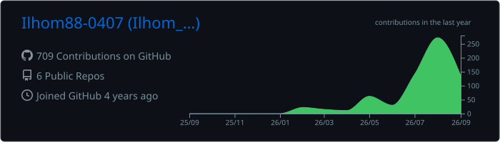
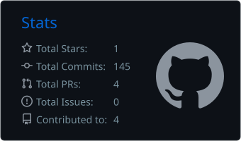
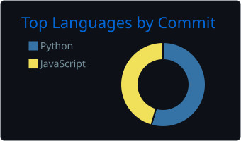

<div align="center">


<a href="https://github.com/Ilhom88-0407">
  
</a>

</div>

```text
<Ilhom-Islomov> display version
 Name        : Ilhom Islomov
 Role        : Network & Cloud Infrastructure Engineer
 Location    : O'zbekiston 🇺🇿
 On GitHub   : 2022-yildan beri
 Mission     : Barqaror, xavfsiz va avtomatlashtirilgan infratuzilma
 Languages   : O'zbek · Русский · English

<Ilhom-Islomov> display interface brief
 Interface        Link  Protocol  Description
 Network          UP    UP        H3C Comware · BGP · DC fabric · NAT · QoS
 Security         UP    UP        WAF (Coraza) · Wazuh SIEM · Anti-DDoS · SSH+MFA
 Monitoring       UP    UP        NetFlow/NetStream · FastNetMon · InfluxDB · Zabbix
 Cloud & DevOps   UP    UP        Kubernetes · Docker · Ansible · Helm · CloudOS
 Code             UP    UP        Python · FastAPI · Go · React · Vue
 AI               UP    UP        LLM · AI agentlar · avtomatlashtirish
```

## 🛰️ Hozir nima ustida ishlayapman

| | Yo'nalish | Qisqacha |
|---|---|---|
| ☁️ | **Bulut platformasi** |  Cloud integratsiyasi — 500+ API, imzolovchi Python mijoz, o'zbekcha konsol qo'llanmasi |
| 🖥️ | **Bare-Metal-as-a-Service** | Redfish / IPMI orqali jismoniy serverlarni avtomatik taqdim etish |
| 📈 | **NetFlow Analyzer** | Router → FastNetMon → InfluxDB → FastAPI + React: trafik tahlili, GeoIP, abuse audit |
| 🛡️ | **NgWAF** | Nginx + Coraza (Go) asosidagi WAF, reverse-proxy va boshqaruv paneli |
| 🌐 | **BIND DNS paneli** | RFC 2136 dynamic update, FastAPI + Vue |
| 🤖 | **Migration agent** | Virtual mashinalar migratsiyasini AI agent yordamida avtomatlashtirish |

## 📚 O'zbek tilida bilim ulashaman

> Texnik bilim hamma uchun ochiq bo'lishi kerak — ona tilida ham.

<table>
<tr>
<td width="50%" valign="top">

### ☸️ [k8s-education](https://github.com/Ilhom88-0407/k8s-education)
Kubernetes'ni noldan **CKA** imtihonigacha — 18 bo'lim, amaliy misollar, mock imtihonlar. To'liq o'zbek tilida.

</td>
<td width="50%" valign="top">

### 🧠 [365AI-udemy](https://github.com/Ilhom88-0407/365AI-udemy)
AI Engineer darsligi: nazariya, amaliy topshiriqlar, SVG diagrammalar va Python misollari.

</td>
</tr>
</table>

## 🧰 Asboblar

<p>
  
  
  
  
  
  
  
  <br/>
  
  
  
  
  
  
  
  
  
</p>

## 📊 GitHub faolligi

<div align="center">
  
  
  
  <br/><br/>
  
</div>

## 🧭 Ish falsafam

```text
<Ilhom-Islomov> display philosophy
 1. Tarmoq ishlasa — hech kim sezmaydi. Ishlamasa — hamma sezadi.
 2. Ikki marta qo'lda qilingan ish — uchinchisida skriptga aylanadi.
 3. Hujjatlashtirilmagan yechim — yarim yechim.
 4. Xavfsizlik — qo'shimcha emas, poydevor.

<Ilhom-Islomov> save force
 The current configuration is saved successfully. ✔
```

## 📡 Aloqa

<p>
  <a href="mailto:mrpocker88@gmail.com"></a>
  <!-- TELEGRAM: <a href="https://t.me/USERNAME"></a> -->
  <!-- LINKEDIN: <a href="https://www.linkedin.com/in/USERNAME"></a> -->
</p>

<div align="center">


</div>
